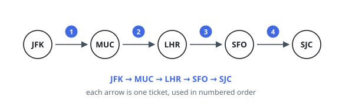
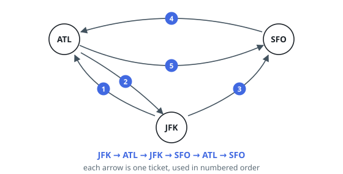

# Reconstruct Itinerary

## Description

You are given a list of airline tickets where `tickets[i] = [from_i, to_i]`
represent the departure and the arrival airports of one flight. Reconstruct the
itinerary in order and return it.

All of the tickets belong to a man who departs from `"JFK"`, thus, the
itinerary must begin with `"JFK"`. If there are multiple valid itineraries, you
should return the itinerary that has the smallest lexical order when read as a
single string.

For example, the itinerary `["JFK", "LGA"]` has a smaller lexical order than
`["JFK", "LGB"]`.

You may assume all tickets form at least one valid itinerary. You must use all
the tickets once and only once.

### Example 1

```text
Input: tickets = [["MUC","LHR"],["JFK","MUC"],["SFO","SJC"],["LHR","SFO"]]
Output: ["JFK","MUC","LHR","SFO","SJC"]
```



### Example 2

```text
Input: tickets = [["JFK","SFO"],["JFK","ATL"],["SFO","ATL"],["ATL","JFK"],["ATL","SFO"]]
Output: ["JFK","ATL","JFK","SFO","ATL","SFO"]
Explanation: Another possible reconstruction is ["JFK","SFO","ATL","JFK","ATL","SFO"] but it is larger in lexical order.
```



### Constraints

- `1 <= tickets.length <= 300`
- `tickets[i].length == 2`
- `from_i.length == 3`
- `to_i.length == 3`
- `from_i` and `to_i` consist of uppercase English letters.
- `from_i != to_i`

## Hints

### Hint 1

This is an Eulerian path problem: you must use every ticket exactly once while always departing from JFK.

### Hint 2

Sort each airport's destinations in ascending lexical order so the smallest option is always explored first.

### Hint 3

A plain greedy 'take the smallest next airport' can strand a flight; Hierholzer's algorithm avoids this by recursively following unused edges and recording the route during the postorder walk.

### Hint 4

Because the graph is guaranteed to have a valid itinerary, reversing the collected postorder route yields the lexicographically smallest one.
