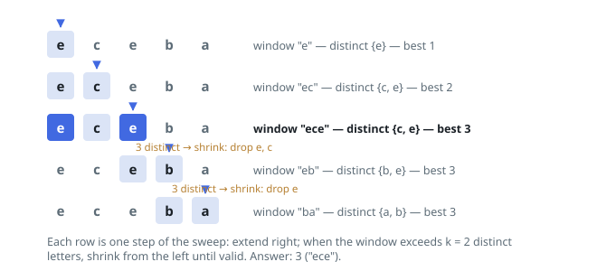

# Solutions — Longest Substring with At Most K Distinct Characters

## Sliding window with character counts

Maintain a window `[left, right]` together with a hash map counting how many times each character occurs inside it. The right end advances one character per iteration; whenever the map grows beyond `k` distinct keys, the left end shrinks in lockstep — decrementing the count of `s[left]` and deleting the key entirely when it reaches zero — until the window is valid again. After each step the window is the longest valid one ending at `right`, so the maximum of `right - left + 1` over the whole sweep is the answer.

Correctness rests on monotonicity: if a window is invalid (more than `k` distinct characters), every window containing it is invalid too, so shrinking from the left never skips a candidate; and each extension by one character can raise the distinct count by at most one, so a short bounded shrink always restores validity. Because `left` and `right` each only move forward, every character is added once and removed at most once.

Edge cases are absorbed by the loop structure: with `k = 0` the shrink loop empties the window after every extension, so the length computed is 0 and the function returns 0; a string shorter than or equal to the first valid window simply never triggers a shrink. The counts map never holds more than `k + 1` entries, since the shrink fires as soon as the `k + 1`-th distinct character appears.

**Complexity:** `O(n)` time, `O(k)` space.
