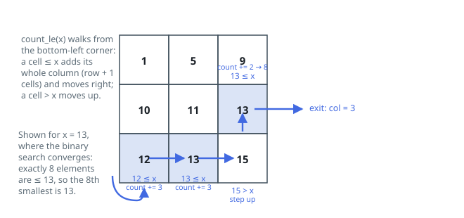

# Solutions — Kth Smallest Element in a Sorted Matrix

## Binary search on value with staircase counting

Instead of searching matrix positions, the algorithm binary-searches the _value_ range `[matrix[0][0], matrix[n-1][n-1]]`. The predicate is monotone — `count_le(x)`, the number of elements `<= x`, is non-decreasing in `x` — so a standard bisection finds the smallest value `x` with `count_le(x) >= k`, which is precisely the kth smallest element. That smallest satisfying value must exist in the matrix: if it did not, the count would be unchanged one step lower, contradicting minimality.

The count itself is where the sorted structure pays off. A staircase walk starts at the bottom-left corner: if the current element is `<= x`, then so is the entire column above it (columns are sorted ascending), so the walk adds `row + 1` and steps right; otherwise the element is too large and so is everything to its right in that row, so it steps up. Each of the `2n` possible moves eliminates a row or a column, making the count `O(n)` with no extra memory — satisfying the requirement to beat `O(n²)` memory and approaching the follow-up's `O(n)`-per-count goal.

The loop `while lo < hi` with `hi = mid` on success converges without ever needing a separate pass to snap the result to an actual matrix element, per the argument above. Edge cases: a 1x1 matrix returns immediately, negative values are handled since the range endpoints come from the matrix itself, and duplicates (like the two 13s in the example) are counted individually by `count_le`, matching "kth smallest, not kth distinct".

**Complexity:** `O(n log(max − min))` time, `O(1)` space.
