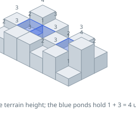
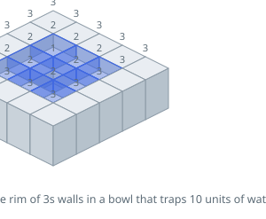

# Trapping Rain Water II

## Description

Given an `m x n` integer matrix `heightMap` representing the height of each
unit cell in a 2D elevation map, return the volume of water it can trap
after raining.

### Example 1

```text
Input: heightMap = [[1,4,3,1,3,2],[3,2,1,3,2,4],[2,3,3,2,3,1]]
Output: 4
Explanation: After the rain, water is trapped between the blocks. We have two small ponds 1 and 3 units trapped. The total volume of water trapped is 4.
```



### Example 2

```text
Input: heightMap = [[3,3,3,3,3],[3,2,2,2,3],[3,2,1,2,3],[3,2,2,2,3],[3,3,3,3,3]]
Output: 10
```



### Constraints

- `m == heightMap.length`
- `n == heightMap[i].length`
- `1 <= m, n <= 200`
- `0 <= heightMap[i][j] <= 2 * 10⁴`

## Hints

### Hint 1

Water can never rest on a border cell — it would spill off the map — so the
fate of every interior cell is decided by the lowest barrier on some path to
the border.

### Hint 2

Start a BFS from all border cells at once, using a min-heap ordered by cell
height. The heap always hands you the lowest point on the current frontier,
which is exactly the next place water could spill over.

### Hint 3

When you pop a frontier cell, every unvisited neighbor either raises the bar
(to the popped cell's height, if the neighbor is taller) or traps water (the
difference, if the neighbor is lower). Push the effective height —
`max(popped, neighbor)` — so the frontier tracks the running water level.
