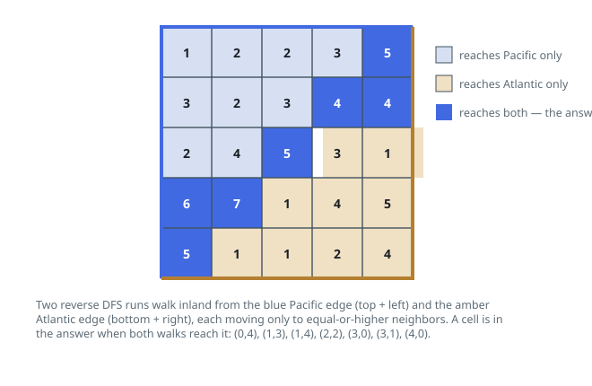

# Solutions — Pacific Atlantic Water Flow

Both solutions invert the flow direction and flood inland from the ocean
borders; they discover identical reachable sets and differ only in the
frontier discipline of the traversal.

## dfs_from_borders

Asking "where can water flow from this cell?" points uphill searches from every interior cell, which is expensive and redundant. The insight is to invert the direction: start from the ocean and walk backwards. A cell can reach an ocean exactly when it is reachable from that ocean's border by a chain of neighbors with non-decreasing height going inland — the reversal of the "water flows to lower or equal" rule.

The `reachable` helper takes a list of border cells, seeds a seen-set and an explicit stack with them, and runs an iterative DFS. From each popped cell `(r, c)` it moves to the four neighbors whose height is at least `heights[r][c]`; those are the cells from which water could have flowed down into the current cell. Marking cells seen on push guarantees each cell enters the stack at most once, so a traversal is linear in the grid size regardless of how tangled the terrain is.

The Pacific search starts from the entire top row and left column; the Atlantic search from the bottom row and right column. Corner cells belong to both seed lists, and a 1x1 grid is trivially in both oceans since its only cell borders everything. The answer is the row-major intersection of the two reachable sets — cells from which some non-increasing path leads to each ocean.

Because each traversal visits every cell at most once and does constant work per visit, the whole algorithm is a constant number of grid passes. The output is built by scanning cells in row-major order, which produces the required sorted ordering directly.

**Complexity:** `O(mn)` time, `O(mn)` space.

## bfs_from_borders

Same reversed flood, different frontier discipline: a FIFO queue. The `reachable` helper takes the same list of border cells, seeds a seen-set and a queue with them, and runs a multi-source BFS: dequeue a cell, then enqueue every unseen neighbor whose height is at least `heights[r][c]` — those are the cells from which water could have flowed down into the current cell. Reachability spreads outward in order of distance from the ocean rather than digging deep first, but the discovered set is the same.

Marking cells seen on enqueue guarantees each cell enters the queue at most once, so a traversal stays linear in the grid size however tangled the terrain is. The Pacific search still starts from the entire top row and left column, the Atlantic search from the bottom row and right column, and corner cells belong to both seed lists.

The answer is assembled by the same row-major scan over the grid collecting cells reachable from both oceans, so the output matches the DFS variant exactly regardless of traversal order.

**Complexity:** `O(mn)` time, `O(mn)` space.
