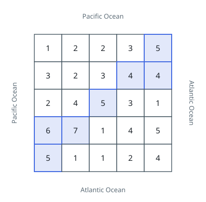

# Pacific Atlantic Water Flow

## Description

There is an `m x n` rectangular island that borders both the Pacific Ocean and
the Atlantic Ocean. The Pacific Ocean touches the island's left and top edges,
and the Atlantic Ocean touches the island's right and bottom edges.

The island is partitioned into a grid of square cells. You are given an
`m x n` integer matrix `heights` where `heights[r][c]` represents the height
above sea level of the cell at coordinate `(r, c)`.

The island receives a lot of rain, and the rain water can flow to neighboring
cells directly north, south, east, and west if the neighboring cell's height
is less than or equal to the current cell's height. Water can flow from any
cell adjacent to an ocean into the ocean.

Return a 2D list of grid coordinates `result` where `result[i] = [ri, ci]`
denotes that rain water can flow from cell `(ri, ci)` to both the Pacific and
Atlantic oceans. Return the coordinates in row-major sorted order (increasing
row index, then increasing column index).

### Example 1

```text
Input: heights = [[1,2,2,3,5],[3,2,3,4,4],[2,4,5,3,1],[6,7,1,4,5],[5,1,1,2,4]]
Output: [[0,4],[1,3],[1,4],[2,2],[3,0],[3,1],[4,0]]
Explanation: The following cells can flow to the Pacific and Atlantic oceans:
[0,4]: [0,4] -> Pacific Ocean, [0,4] -> Atlantic Ocean
[1,3]: [1,3] -> [0,3] -> Pacific Ocean, [1,3] -> [1,4] -> Atlantic Ocean
[1,4]: [1,4] -> [1,3] -> [0,3] -> Pacific Ocean, [1,4] -> Atlantic Ocean
[2,2]: [2,2] -> [1,2] -> [0,2] -> Pacific Ocean,
        [2,2] -> [2,3] -> [2,4] -> Atlantic Ocean
[3,0]: [3,0] -> Pacific Ocean, [3,0] -> [4,0] -> Atlantic Ocean
[3,1]: [3,1] -> [3,0] -> Pacific Ocean, [3,1] -> [4,1] -> Atlantic Ocean
[4,0]: [4,0] -> Pacific Ocean, [4,0] -> Atlantic Ocean
Note that there are other possible paths for these cells to flow to the
Pacific and Atlantic oceans.
```



### Example 2

```text
Input: heights = [[1]]
Output: [[0,0]]
Explanation: The water can flow from the only cell to the Pacific and
Atlantic oceans.
```

### Constraints

- `m == heights.length`
- `n == heights[r].length`
- `1 <= m, n <= 200`
- `0 <= heights[r][c] <= 10^5`

## Hints

### Hint 1

Flow the water backwards: start a DFS/BFS from the cells touching each ocean and move to neighboring cells of greater or equal height.

### Hint 2

Compute the set of cells reachable from the Pacific border and the set reachable from the Atlantic border independently.

### Hint 3

A cell belongs to the answer exactly when it appears in both reachable sets.

### Hint 4

Each traversal should visit each cell at most once, keeping the total work at O(m*n).
