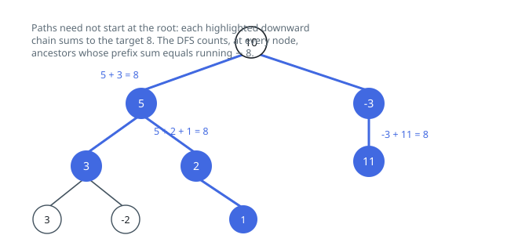

# Solutions — Path Sum III

## Prefix Sums on the Tree

A downward path from node u to node v has sum `prefix(v) - prefix(u)`, where prefix(x) is the running sum of values from the root down to x. So paths ending at the current node with sum `targetSum` correspond to earlier ancestors whose prefix equals `running - targetSum` — the subarray-sum-count trick transplanted onto a tree.

A single DFS carries the running root-to-node sum and a hash map from prefix value to how many nodes on the current path have it. The map is seeded with `{0: 1}` so that a path starting at the current node itself (prefix difference of exactly the whole running sum) is counted. At each node the code adds `counter[running - targetSum]` to the total, then registers its own prefix before recursing into both children.

The crucial tree-specific detail is the decrement `counter[running] -= 1` after the children return: paths must be contiguous down the tree, so a prefix recorded in the left subtree must not pair with nodes in the right subtree. Removing the current prefix on backtrack confines every lookup to ancestors of the node being visited, which is exactly the set of valid path starts.

Each node is visited once and does O(1) average hash-map work, so one traversal settles the count even on a skewed 1000-node chain, and negative values pose no problem because the map keys are arbitrary integers. An empty tree returns 0 immediately from the `not node` guard.

**Complexity:** `O(n)` time, `O(n)` space (prefix map plus recursion depth).
