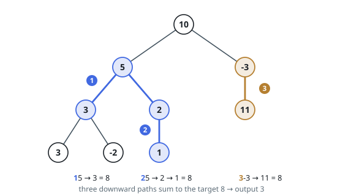

# Path Sum III

## Description

Given the `root` of a binary tree and an integer `targetSum`, return the
number of paths where the sum of the values along the path equals
`targetSum`.

The path does not need to start or end at the root or a leaf, but it must go
downwards (i.e., traveling only from parent nodes to child nodes).

### Example 1

```text
Input: root = [10,5,-3,3,2,null,11,3,-2,null,1], targetSum = 8
Output: 3
Explanation: The paths that sum to 8 are shown.
```



### Example 2

```text
Input: root = [5,4,8,11,null,13,4,7,2,null,null,5,1], targetSum = 22
Output: 3
```

### Constraints

- The number of nodes in the tree is in the range `[0, 1000]`.
- `-10^9 <= Node.val <= 10^9`
- `-1000 <= targetSum <= 1000`

## Hints

### Hint 1

For each node, count paths ending there using prefix sums along the root-to-node path.

### Hint 2

Store how many earlier prefixes equal currentSum - targetSum in a hash map (the subarray-sum-count trick applied to trees).

### Hint 3

Seed the map with prefix 0 so paths starting at the current node are counted.

### Hint 4

Decrement the current prefix when backtracking so sibling subtrees are unaffected.
