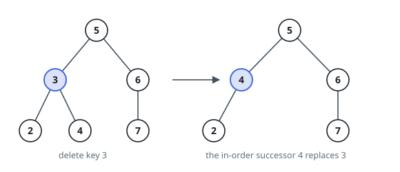
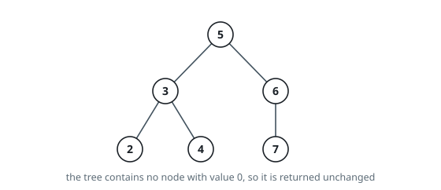

# Delete Node in a BST

## Description

Given a root node reference of a BST and a key, delete the node with the
given key in the BST. Return the root node reference (possibly updated) of
the BST.

Basically, the deletion can be divided into two stages:

1. Search for a node to remove.
2. If the node is found, delete the node.

When the node to delete has two children, copy its in-order successor's value
(the minimum value in its right subtree) into the node, then delete that
successor node from the right subtree. The tree is serialized in level order
with `null` holes for missing children and trailing `null`s trimmed.

### Example 1

```text
Input: root = [5,3,6,2,4,null,7], key = 3
Output: [5,4,6,2,null,null,7]
Explanation: Given key to delete is 3. So we find the node with value 3 and
delete it. One valid answer is [5,4,6,2,null,null,7]. Please notice that
another valid answer is [5,2,6,null,4,null,7] and it's also accepted.
```



### Example 2

```text
Input: root = [5,3,6,2,4,null,7], key = 0
Output: [5,3,6,2,4,null,7]
Explanation: The tree does not contain a node with value = 0.
```



### Example 3

```text
Input: root = [], key = 0
Output: []
```

### Constraints

- The number of nodes in the tree is in the range `[0, 10^4]`.
- `-10^5 <= Node.val <= 10^5`
- Each node has a unique value.
- `root` is a valid binary search tree.
- `-10^5 <= key <= 10^5`

Follow up: Could you solve it with time complexity `O(height of tree)`?

## Hints

### Hint 1

Search by BST ordering: go left if key < node.val, right if key > node.val.

### Hint 2

Leaf and one-child deletions just splice the node out of the tree.

### Hint 3

With two children, copy the in-order successor's value into the node, then delete the successor from the right subtree.
