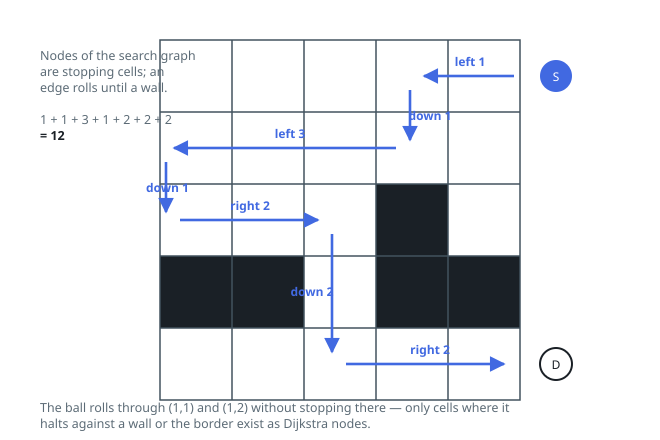

# Solutions — The Maze II

## Dijkstra over Stopping Cells

The ball is only ever controllable where it rests, so the maze is a graph whose nodes are _stopping cells_ — positions where the ball halts against a wall or the border. From each such cell the code simulates rolling in each of the four directions step by step until the next cell would be a wall or out of bounds; the landing cell is the neighbor, and the number of cells rolled is the edge weight. Because different rolls cover different distances, edges have varying weights, which rules out plain BFS and calls for Dijkstra.

The search keeps `dist`, the best known distance per stopping cell, and a heap of `(distance, cell)` pairs. Each pop either returns — when the destination comes off the heap, its distance is final, since Dijkstra settles cells in order of distance — or is discarded as stale when the popped distance exceeds the recorded one. Otherwise the four rolls are simulated; a roll that covers zero steps is skipped, and a landing cell is relaxed only when `d + steps` improves its recorded distance, then pushed. If the heap empties without the destination ever appearing, the ball cannot _stop_ there and the answer is `-1`.

Encoding the state as stopping cells captures the problem's subtlety for free: the ball may pass over the destination while rolling, but only a roll that ends exactly on it produces that node, and the start cell enters the heap at cost 0. With `m, n <= 100` there are at most `mn` cells, each settled once with four roll simulations of up to `m + n` steps apiece, plus the heap's logarithmic factor.

**Complexity:** `O(mn(m+n)log(mn))` time, `O(mn)` space.
