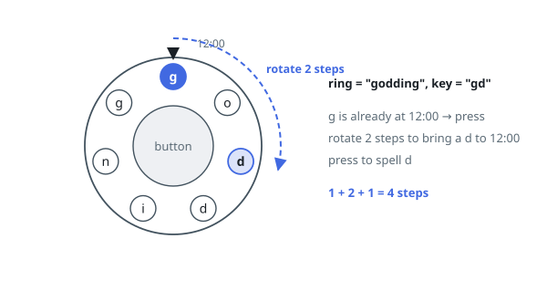

# Freedom Trail

## Description

In the video game Fallout 4, the quest "Road to Freedom" requires players to
reach a metal dial called the "Freedom Trail Ring" and use the dial to spell
a specific keyword to open the door.

Given a string `ring` that represents the code engraved on the outer ring and
another string `key` that represents the keyword that needs to be spelled,
return the minimum number of steps to spell all the characters in the
keyword.

Initially, the first character of the ring is aligned at the "12:00"
direction. You should spell all the characters in `key` one by one by
rotating `ring` clockwise or anticlockwise to make each character of the
string `key` aligned at the "12:00" direction and then by pressing the center
button.

At the stage of rotating the ring to spell the character `key[i]`:

- You can rotate the ring clockwise or anticlockwise by one place, which
  counts as one step. The final purpose of the rotation is to align one of
  `ring`'s characters at the "12:00" direction, where this character must
  equal `key[i]`.
- If the character `key[i]` has been aligned at the "12:00" direction, press
  the center button to spell, which also counts as one step. After the
  pressing, you could begin to spell the next character in the `key` (next
  stage). Otherwise, you have finished all the spelling.

### Example 1

```text
Input: ring = "godding", key = "gd"
Output: 4
Explanation:
For the first key character 'g', since it is already in place, we just need 1 step to spell this character.
For the second key character 'd', we need to rotate the ring "godding" anticlockwise by two steps to make it become "ddinggo".
Also, we need 1 more step for spelling.
So the final output is 4.
```



### Example 2

```text
Input: ring = "godding", key = "godding"
Output: 13
```

### Constraints

- `1 <= ring.length, key.length <= 100`
- `ring` and `key` consist of only lower case English letters.
- It is guaranteed that `key` could always be spelled by rotating `ring`.

## Hints

### Hint 1

The state you need is (index into key, current position of ring aligned at 12:00) — the minimal steps to reach it.

### Hint 2

For each occurrence of key[i] in ring, the rotation cost from position i to position j is min(|i - j|, ring.length - |i - j|), plus 1 for the button press.

### Hint 3

Process key left to right, keeping a dictionary of best costs per aligned ring index; the answer adds one press per key character.
