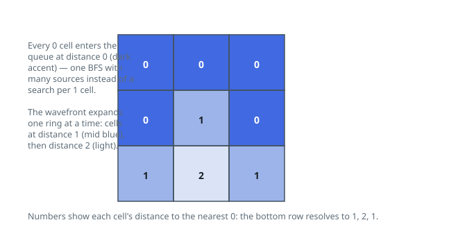

# Solutions — 01 Matrix

## Multi-Source BFS

Asking for each cell's distance to the nearest zero becomes much cheaper when asked in reverse: instead of searching outward from every `1` (which repeats work across overlapping searches), all `0` cells broadcast simultaneously. A single BFS starts with every zero already in the queue at distance 0, and the wavefront expands in unit steps over the four orthogonal neighbors — so the first time any wave reaches a cell, it has arrived via a shortest path from its nearest zero.

The implementation marks distances in place: `dist` starts as `None` everywhere, every `mat[i][j] == 0` cell is seeded with 0 and enqueued, and a cell is relaxed only while its distance is still `None`, which doubles as the visited check. Setting the distance before enqueueing (rather than at dequeue time) is what prevents duplicate queue entries, so each cell enters the queue exactly once and the whole traversal is linear in the number of cells. Zero cells themselves are already correct at 0 and are never overwritten.

Correctness rests on the BFS invariant: cells are dequeued in non-decreasing distance order, so when a `None` neighbor is first assigned `dist + 1`, no shorter path to it can appear later. The guarantee of at least one zero seeds the queue, and the `None` check makes walls of `1`s simply resolve at their wavefront distance. The output matrix and the queue, which at peak holds no more than the perimeter of the current wavefront, are both bounded by the grid size.

**Complexity:** `O(m·n)` time, `O(m·n)` space.
