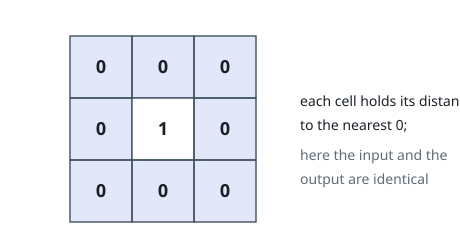
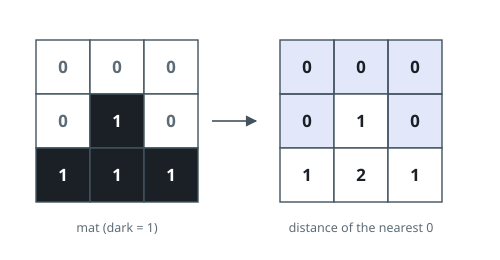

# 01 Matrix

## Description

Given an `m x n` binary matrix `mat`, return the distance of the nearest `0`
for each cell.

The distance between two cells sharing a common edge is `1`.

### Example 1

```text
Input: mat = [[0,0,0],[0,1,0],[0,0,0]]
Output: [[0,0,0],[0,1,0],[0,0,0]]
```



### Example 2

```text
Input: mat = [[0,0,0],[0,1,0],[1,1,1]]
Output: [[0,0,0],[0,1,0],[1,2,1]]
```



### Constraints

- `m == mat.length`
- `n == mat[i].length`
- `1 <= m, n <= 10^4`
- `1 <= m * n <= 10^4`
- `mat[i][j]` is either `0` or `1`.
- There is at least one `0` in `mat`.

## Hints

### Hint 1

Think in reverse: instead of searching from each 1-cell, start a multi-source BFS from every 0-cell at once.

### Hint 2

Each 0-cell starts with distance 0; expanding to unvisited neighbors gives their distance to the nearest 0.

### Hint 3

Alternatively, two DP sweeps (top-left then bottom-right) also solve it without a queue.
