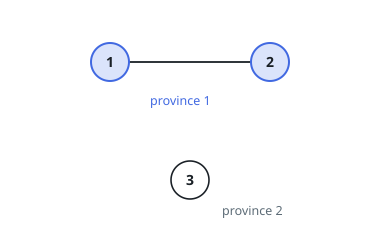
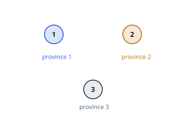

# Number of Provinces

## Description

There are `n` cities. Some of them are connected, while some are not. If city
`a` is connected directly with city `b`, and city `b` is connected directly
with city `c`, then city `a` is connected indirectly with city `c`.

A province is a group of directly or indirectly connected cities and no other
cities outside of the group.

You are given an `n x n` matrix `isConnected` where `isConnected[i][j] = 1` if
the `i^th` city and the `j^th` city are directly connected, and
`isConnected[i][j] = 0` otherwise.

Return the total number of provinces.

### Example 1

```text
Input: isConnected = [[1,1,0],[1,1,0],[0,0,1]]
Output: 2
```



### Example 2

```text
Input: isConnected = [[1,0,0],[0,1,0],[0,0,1]]
Output: 3
```



### Constraints

- `1 <= n <= 200`
- `n == isConnected.length`
- `n == isConnected[i].length`
- `isConnected[i][j]` is `1` or `0`.
- `isConnected[i][i] == 1`
- `isConnected[i][j] == isConnected[j][i]`

## Hints

### Hint 1

Provinces are exactly the connected components of the city graph.

### Hint 2

Run a DFS or BFS from every not-yet-visited city; each launch discovers precisely one new province.

### Hint 3

Union-Find works just as well: union every pair with isConnected[i][j] == 1, then count distinct roots.
