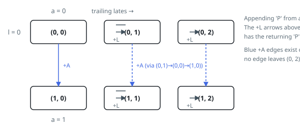

# Solutions — Student Attendance Record II

## Dynamic Programming on (Absences, Trailing Lates)

A record is eligible exactly when it contains fewer than two `'A'` characters and never three consecutive `'L'` characters. That means the only facts about a prefix that matter for extending it are how many absences it has already used (0 or 1) and how many consecutive lates it currently ends with (0, 1, or 2). This gives a tiny state space: `dp[a][l]` counts eligible prefixes with `a` absences and `l` trailing lates — six states in total.

The solution seeds `dp[0][0] = 1` for the empty prefix and rebuilds the table once per day. Each state fans out over the three possible next characters: appending `'P'` keeps `a` and resets the trailing-late count to 0; appending `'A'` is allowed only from `a = 0` and moves to `a = 1` with trailing lates reset; appending `'L'` is allowed only while `l < 2` and increments `l`. All additions are taken modulo 10^9 + 7 so the counts stay bounded.

Because the state machine refuses to extend prefixes that already have two absences or a run of two lates with another `'L'`, no invalid record is ever counted — invalid strings are pruned the moment they would form, rather than filtered afterwards. After `n` iterations the answer is simply the sum of the six states.

The state space is constant, so each of the `n` days costs constant work. The base case `n = 1` falls out naturally, yielding the three single-character records.

Stepping Example 1 (`n = 2`) through the table shows the state machine at work:

1. Seed the empty prefix: `dp = [[1, 0, 0], [0, 0, 0]]`.
2. After day 1 the lone `(0,0)` state fans out over `P`, `A`, `L`, giving `dp = [[1, 1, 0], [1, 0, 0]]` — the three one-character records.
3. After day 2 every state fans out again (for instance `(0,1)`, the record "L", still accepts a second `L`), giving `dp = [[2, 1, 1], [3, 1, 0]]`.
4. The answer is the sum `2 + 1 + 1 + 3 + 1 + 0 = 8`: exactly the eight eligible records "PP", "AP", "PA", "LP", "PL", "AL", "LA", "LL".

**Complexity:** `O(n)` time, `O(1)` space.
