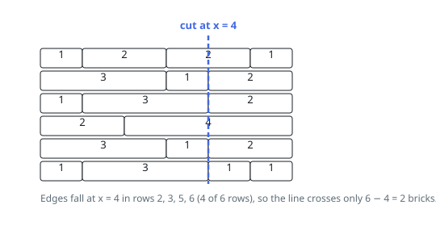

# Solutions — Brick Wall

## Prefix-Sum Edge Counting

A vertical line at horizontal position `p` crosses a row if and only if that row has no brick edge at `p`. So instead of thinking about which bricks get cut, flip the question: find the position where the most rows have an edge, and draw the line there. The minimum number of crossed bricks is then the number of rows minus that maximum edge count.

For each row, the solution walks the bricks and accumulates a running position, recording every prefix sum except the last one — the final cumulative width is the wall's right border, which the problem forbids using. Each recorded position is counted in a hash map. Skipping only the last brick per row (`row[:-1]`) is what enforces the "not along the wall edges" rule.

Once all rows are processed, the answer is `len(wall) - max(edge_counts.values(), default=0)`. The `default=0` handles the degenerate case where every row is a single brick: no interior edges exist anywhere, so any line must cross every row, and the formula returns exactly the row count.

The work is one pass over every brick in the wall, and the map holds at most one entry per brick. Positions are cumulative sums of widths up to 2^31 - 1 each, so they can exceed 32-bit range; Python's arbitrary-precision integers absorb this, but fixed-width ports need a 64-bit accumulator.

**Complexity:** `O(S)` time, `O(S)` space, where `S` is the total number of bricks across all rows.
