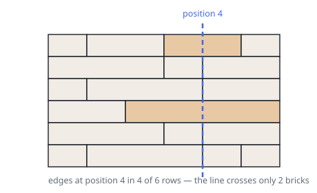

# Brick Wall

## Description

There is a rectangular brick wall in front of you with `n` rows of bricks.
The `i^th` row has some number of bricks each of the same height (i.e., one
unit) but they can be of different widths. The total width of each row is the
same.

Draw a vertical line from the top to the bottom and cross the least bricks.
If your line goes through the edge of a brick, then the brick is not
considered as crossed. You cannot draw a line just along one of the two
vertical edges of the wall, in which case the line will obviously cross no
bricks.

Given the 2D array `wall` that contains the information about the wall, return
the minimum number of crossed bricks after drawing such a vertical line.

### Example 1

```text
Input: wall = [[1,2,2,1],[3,1,2],[1,3,2],[2,4],[3,1,2],[1,3,1,1]]
Output: 2
```



### Example 2

```text
Input: wall = [[1],[1],[1]]
Output: 3
```

### Constraints

- `n == wall.length`
- `1 <= n <= 10^4`
- `1 <= wall[i].length <= 10^4`
- `1 <= sum(wall[i].length) <= 2 * 10^4`
- `sum(wall[i])` is the same for each row `i`.
- `1 <= wall[i][j] <= 2^31 - 1`

## Hints

### Hint 1

A vertical line at cumulative-width position p crosses exactly the rows that have no brick edge at p.

### Hint 2

For each row, record every prefix sum except the full-row width (that edge is the wall border).

### Hint 3

The answer is the number of rows minus the highest edge-position frequency.

### Hint 4

Prefix sums can exceed 32-bit range, so accumulate in a 64-bit type.
