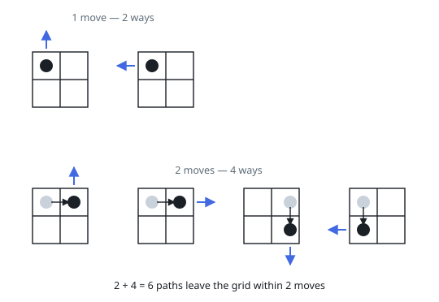
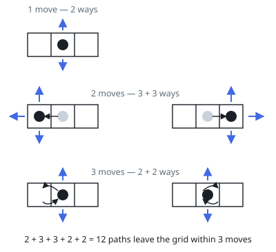

# Out of Boundary Paths

## Description

There is an `m x n` grid with a ball. The ball is initially at the position
`[startRow, startColumn]`. You are allowed to move the ball to one of the four
adjacent cells in the grid (possibly out of the grid crossing the grid
boundary). You can apply at most `maxMove` moves to the ball.

Given the five integers `m`, `n`, `maxMove`, `startRow`, and `startColumn`,
return the number of paths to move the ball out of the grid boundary. Since
the answer can be very large, return it modulo `10^9 + 7`.

### Example 1

```text
Input: m = 2, n = 2, maxMove = 2, startRow = 0, startColumn = 0
Output: 6
```



### Example 2

```text
Input: m = 1, n = 3, maxMove = 3, startRow = 0, startColumn = 1
Output: 12
```



### Constraints

- `1 <= m, n <= 50`
- `0 <= maxMove <= 50`
- `0 <= startRow < m`
- `0 <= startColumn < n`

## Hints

### Hint 1

Traversing every path is not feasible: even a small matrix has a huge number of possible paths. Count paths instead of walking them.

### Hint 2

Use extra space to store, for each cell, the number of paths that are standing on it after exactly t moves, and update these counts move by move.

### Hint 3

The ball only leaves the grid by crossing it: from a non-corner boundary cell exactly one direction exits, and from a corner cell exactly two directions exit. Use that when updating the counts.
