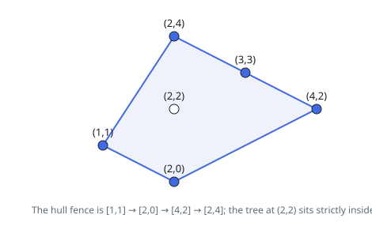

# Solutions — Erect the Fence

## Monotone Chain Convex Hull with Collinear Recovery

The trees on the fence perimeter are exactly the points of the convex hull — but with a twist specific to this problem: trees lying on a hull edge (not just at its corners) are also on the perimeter and must be returned. The solution first computes the strict hull with Andrew's monotone chain, then sweeps back to recover the collinear boundary points.

Points are deduplicated and sorted. Two stack passes build the lower and upper hulls: for each new point, the stack pops while the last three points make a non-left turn (`cross <= 0`), which discards collinear and clockwise points, leaving only strict corners. Concatenating the two chains with their duplicated endpoints removed yields the hull vertices in counter-clockwise order.

A final recovery pass handles the collinear trees. For each hull edge, every remaining point is tested: if its cross product with the edge is zero and it lies within the edge's coordinate bounds, it sits on that edge and is appended to the result. A set of already-included points prevents a point shared by adjacent edges from being added twice. Degenerate inputs fall out cleanly — a single tree returns itself, and a fully collinear input produces a two-vertex "hull" whose single edge then absorbs all the interior points.

Sorting dominates the hull construction, and the recovery pass is a double loop of every point against every hull edge, so a hull with many vertices on scattered points is the worst case.

**Complexity:** `O(P log P + H · P)` time, `O(P)` space, where `P` is the number of points and `H` the number of hull vertices.
