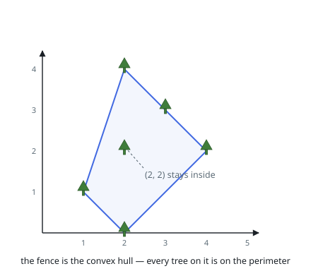
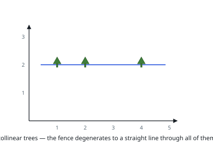

# Erect the Fence

## Description

You are given an array `trees` where `trees[i] = [xi, yi]` represents the
location of a tree in the garden.

Fence the entire garden using the minimum length of rope, as it is expensive.
The garden is well-fenced only if all the trees are enclosed.

Return the coordinates of trees that are exactly located on the fence
perimeter. You may return the answer in any order.

### Example 1

```text
Input: trees = [[1,1],[2,2],[2,0],[2,4],[3,3],[4,2]]
Output: [[1,1],[2,0],[4,2],[3,3],[2,4]]
Explanation: All the trees will be on the perimeter of the fence except the tree at [2, 2], which will be inside the fence.
```



### Example 2

```text
Input: trees = [[1,2],[2,2],[4,2]]
Output: [[4,2],[2,2],[1,2]]
Explanation: The fence forms a line that passes through all the trees.
```



### Constraints

- `1 <= trees.length <= 3000`
- `trees[i].length == 2`
- `0 <= xi, yi <= 100`
- All the given positions are unique.

## Hints

### Hint 1

The trees on the fence perimeter are exactly the points on the convex hull of the tree positions.

### Hint 2

Andrew's monotone chain sorts the points and builds the lower and upper hulls, each with a stack that pops points making a clockwise turn.

### Hint 3

When several trees lie on the same hull edge, every one of them is on the perimeter and must be included in the answer.
