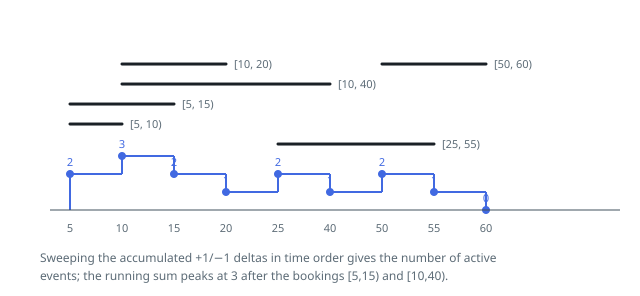

# Solutions — My Calendar III

## Boundary Delta Sweep

Every booking `[start, end)` reduces to two boundary events: `+1` at `start` and `-1` at `end`, accumulated in a dictionary keyed by time. Walking the times in sorted order, the running sum of these deltas is exactly the number of events active at that moment, so the largest running sum observed anywhere in the sweep is the maximum k-booking the calendar has reached — precisely what each `book` call must return.

Each `book` call inserts its two deltas and then re-sweeps all stored boundaries, tracking the running sum and its maximum. The half-open convention needs no tie-breaking: the dictionary merges all deltas at the same time into one net change, and after applying it the sum equals the number of events whose half-open interval covers times from that boundary up to the next. An event ending exactly where another begins therefore never counts both, and boundary-touching bookings never inflate the overlap count.

Rebuilding the sweep from scratch on every call is a deliberate simplification and comfortably fast here: after `n` bookings there are at most `2n` boundary keys, so each call sorts and scans at most that many entries, and with at most 400 calls the entire run does on the order of a few hundred thousand steps.

**Complexity:** `O(n^2 log n)` time over `n` bookings, `O(n)` space.
