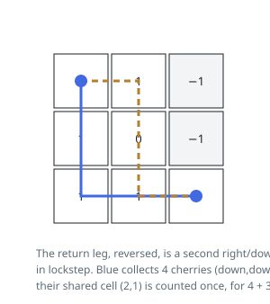

# Solutions — Cherry Pickup

## Two-Walker Lockstep Dynamic Programming

The return leg, reversed, is just a second monotone right/down path from corner to corner, and a cherry picked on either trip counts once. So the round trip equals two walkers leaving `(0, 0)` together and each moving only right or down to `(n-1, n-1)`, where a cell visited by both contributes its cherry only once. The trick that makes this tractable is advancing them in lockstep: after `t` steps walker one is at `(r1, t - r1)` and walker two at `(r2, t - r2)`, so a single shared step counter layers the DP and guarantees that only same-time positions are ever combined — the walkers can share a cherry only when they stand on the same cell at the same step, detected as `r1 == r2`.

The state `dp[r1][r2]` holds the best combined total for the current layer, and each layer is built fresh from the previous one, each walker having arrived from above or from the left — four predecessor states, of which the best reachable is taken. Thorn cells and out-of-range rows are skipped, unreachable states keep the `-1` sentinel, and a state whose every predecessor is unreachable stays unreachable itself, so impossibility propagates. The per-step gain is `grid[r1][c1]` plus `grid[r2][c2]` only when the walkers are on different cells. Looping `r2` from `r1` exploits the walkers' interchangeability and halves the state space.

The answer is the final corner state clamped at 0: if no path exists, the sentinel survives to the end and the function correctly reports that no cherries can be collected. Layers run `t` from 1 to `2n - 2`, each with at most `n^2 / 2` states and constant work per state, with only two layers alive at a time.

**Complexity:** `O(n^3)` time, `O(n^2)` space.
