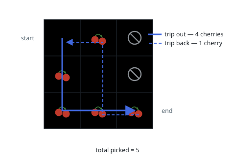

# Cherry Pickup

## Description

You are given an `n x n` grid representing a field of cherries, where each cell
is one of three possible integers:

- `0` means the cell is empty, so you can pass through,
- `1` means the cell contains a cherry that you can pick up and pass through,
- `-1` means the cell contains a thorn that blocks your way.

Return the maximum number of cherries you can collect by following the rules
below:

- Starting at the position `(0, 0)` and reaching `(n - 1, n - 1)` by moving
  right or down through valid path cells (cells with value `0` or `1`).
- After reaching `(n - 1, n - 1)`, returning to `(0, 0)` by moving left or up
  through valid path cells.
- When passing through a path cell containing a cherry, you pick it up, and
  the cell becomes an empty cell `0`.
- If there is no valid path between `(0, 0)` and `(n - 1, n - 1)`, then no
  cherries can be collected.

### Example 1

```text
Input: grid = [[0,1,-1],[1,0,-1],[1,1,1]]
Output: 5
Explanation: The player started at (0, 0) and went down, down, right, right to reach (2, 2). 4 cherries were picked up during this single trip, and the grid becomes [[0,1,-1],[0,0,-1],[0,0,0]]. Then, the player went left, up, up, left to return home, picking up one more cherry. The total number of cherries picked up is 5, and this is the maximum possible.
```



### Example 2

```text
Input: grid = [[1,1,-1],[1,-1,1],[-1,1,1]]
Output: 0
Explanation: No valid path exists from (0, 0) to (2, 2), so no cherries are collected.
```

### Constraints

- `n == grid.length`
- `n == grid[i].length`
- `1 <= n <= 50`
- `grid[i][j]` is `-1`, `0`, or `1`.
- `grid[0][0] != -1`
- `grid[n - 1][n - 1] != -1`

## Hints

### Hint 1

Instead of modeling the round trip as "go, then come back", think of two
walkers leaving `(0, 0)` at the same time and both heading toward
`(n - 1, n - 1)`, each moving only right or down. The return trip reversed is
just a second forward path, and a cherry picked on either trip counts once.

### Hint 2

Advance both walkers in lockstep: after `t` steps, walker 1 is at `(r1, t-r1)`
and walker 2 is at `(r2, t-r2)`. This shared step count `t` is the DP layer,
so a state only ever combines positions reachable at the same time, and
`r1 == r2` means both walkers stand on the same cell — count that cherry once.

### Hint 3

Let `dp[t][r1][r2]` be the best total over the two partial paths. Each state
comes from one of four predecessors at step `t - 1` (each walker arrived from
above or from the left). Use a sentinel like negative infinity for states
blocked by thorns or out of range, and the answer is the final-state value —
or `0` if it is still unreachable.
