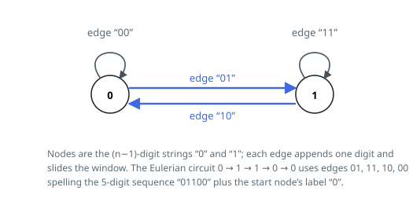

# Solutions — Cracking the Safe

## Eulerian Circuit on the de Bruijn Graph

Build the graph whose nodes are all `k^(n-1)` strings of `n-1` digits, held as base-`k` integers: each node has exactly `k` outgoing edges, one per next digit, and the `k^n` edges correspond one-to-one with the possible passwords — traversing an edge appends its digit and slides the window. A sequence that tries every password with maximum overlap is exactly an Eulerian circuit using every edge once; since every node also has in-degree `k`, the graph is balanced and such a circuit always exists, giving the optimal length of `k^n + n - 1` typed digits.

The solution is an iterative Hierholzer walk. A node stack records the current path, and a parallel digit stack remembers which digit entered each stacked node. From the node on top, take the lowest-numbered unused edge — marking it seen in a flag array of size `k^n` — and push the successor `(node · k + digit) mod k^(n-1)`, the window shifted by one digit. When a node has no unused edges left, pop it and emit the digit that entered it.

Emitting digits on pop is the post-order discipline that keeps the walk from getting stuck: a node's exits are only known to be exhausted when it comes off the stack, and edges pushed past a dead end get stitched into the circuit by the pops that follow. Because the walk starts at node 0, the emitted digits together with the start node's label of `n - 1` zeros — appended by the code — rebuild the full sequence, and trying digits in ascending order makes the output deterministic. Each push or pop scans at most `k` digit slots, and pushes are bounded by the number of edges.

**Complexity:** `O(k^(n+1))` time, `O(k^n)` space.
