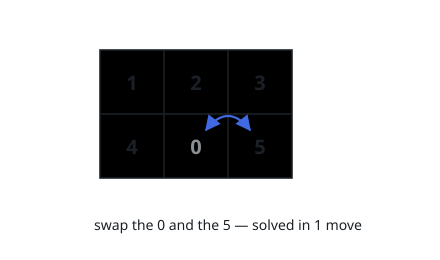

# Sliding Puzzle

## Description

On an `2 x 3` board, there are five tiles labeled from `1` to `5`, and an empty square represented by `0`. A move consists of choosing `0` and a 4-directionally adjacent number and swapping it.

The state of the board is solved if and only if the board is `[[1,2,3],[4,5,0]]`.

Given the puzzle board `board`, return the least number of moves required so that the state of the board is solved. If it is impossible for the state of the board to be solved, return `-1`.

### Example 1

```text
Input: board = [[1,2,3],[4,0,5]]
Output: 1
Explanation: Swap the 0 and the 5 in one move.
```



### Example 2

```text
Input: board = [[1,2,3],[5,4,0]]
Output: -1
Explanation: No number of moves will make the board solved.
```

![Starting from [[1,2,3],[5,4,0]], no sequence of moves reaches the solved board.](figures/example-2.svg)

### Example 3

```text
Input: board = [[4,1,2],[5,0,3]]
Output: 5
Explanation: 5 is the smallest number of moves that solves the board.
An example path:
After move 0: [[4,1,2],[5,0,3]]
After move 1: [[4,1,2],[0,5,3]]
After move 2: [[0,1,2],[4,5,3]]
After move 3: [[1,0,2],[4,5,3]]
After move 4: [[1,2,0],[4,5,3]]
After move 5: [[1,2,3],[4,5,0]]
```

![A five-move sequence from [[4,1,2],[5,0,3]] to the solved board.](figures/example-3.svg)

### Constraints

- `board.length == 2`
- `board[i].length == 3`
- `0 <= board[i][j] <= 5`
- Each value `board[i][j]` is unique.

## Hints

### Hint 1

Perform a breadth-first search where the nodes are puzzle boards and edges connect two boards that can be transformed into one another with one move.

### Hint 2

Represent each board compactly (for example, a string or tuple of its six values) so visited states can be stored in a hash set.

### Hint 3

There are only 6! = 720 possible boards, so the BFS from the start state is tiny; if the target state is never reached, return -1.
