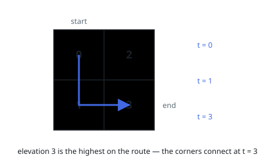
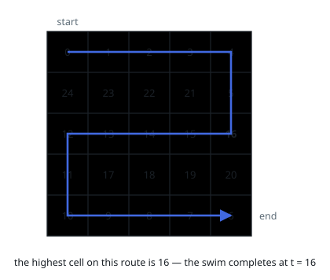

# Swim in Rising Water

## Description

You are given an `n x n` integer matrix `grid` where each value `grid[i][j]` represents the elevation at that point `(i, j)`.

It starts raining, and water gradually rises over time. At time `t`, the water level is `t`, meaning any cell with elevation less than equal to `t` is submerged or reachable.

You can swim from a square to another 4-directionally adjacent square if and only if the elevation of both squares individually are at most `t`. You can swim infinite distances in zero time. Of course, you must stay within the boundaries of the grid during your swim.

Return the minimum time until you can reach the bottom right square `(n - 1, n - 1)` if you start at the top left square `(0, 0)`.

### Example 1

```text
Input: grid = [[0,2],[1,3]]
Output: 3
Explanation:
At time 0, you are in grid location (0, 0).
You cannot go anywhere else because 4-directionally adjacent neighbors have a higher elevation than t = 0.
You cannot reach point (1, 1) until time 3.
When the depth of water is 3, we can swim anywhere inside the grid.
```



### Example 2

```text
Input: grid = [[0,1,2,3,4],[24,23,22,21,5],[12,13,14,15,16],[11,17,18,19,20],[10,9,8,7,6]]
Output: 16
Explanation: The final route is shown.
We need to wait until time 16 so that (0, 0) and (4, 4) are connected.
```



### Constraints

- `n == grid.length`
- `n == grid[i].length`
- `1 <= n <= 50`
- `0 <= grid[i][j] < n^2`
- Each value `grid[i][j]` is unique.

## Hints

### Hint 1

Use Dijkstra's algorithm, or binary search for the best time T for which you can reach the end if you only step on squares at most T.

### Hint 2

The cost of a path is the maximum elevation along it, so a Dijkstra step relaxes neighbors with max(current time, neighbor elevation).

### Hint 3

For the binary-search variant, a plain BFS/DFS over cells with elevation <= T tells you whether T is enough.
