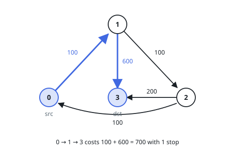
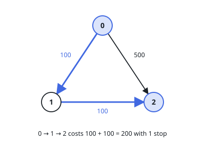
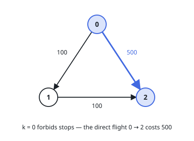

# Cheapest Flights Within K Stops

## Description

There are `n` cities connected by some number of flights. You are given an array `flights` where `flights[i] = [from_i, to_i, price_i]` indicates that there is a flight from city `from_i` to city `to_i` with cost `price_i`.

You are also given three integers `src`, `dst`, and `k`, return the cheapest price from `src` to `dst` with at most `k` stops. If there is no such route, return `-1`.

### Example 1

```text
Input: n = 4, flights = [[0,1,100],[1,2,100],[2,0,100],[1,3,600],[2,3,200]], src = 0, dst = 3, k = 1
Output: 700
Explanation:
The optimal path with at most 1 stop from city 0 to 3 is marked in red and has cost 100 + 600 = 700.
Note that the path through cities [0,1,2,3] is cheaper but is invalid because it uses 2 stops.
```



### Example 2

```text
Input: n = 3, flights = [[0,1,100],[1,2,100],[0,2,500]], src = 0, dst = 2, k = 1
Output: 200
Explanation:
The graph is shown above.
The optimal path with at most 1 stop from city 0 to 2 is marked in red and has cost 100 + 100 = 200.
```



### Example 3

```text
Input: n = 3, flights = [[0,1,100],[1,2,100],[0,2,500]], src = 0, dst = 2, k = 0
Output: 500
Explanation:
The graph is shown above.
The optimal path with no stops from city 0 to 2 is marked in red and has cost 500.
```



### Constraints

- `2 <= n <= 100`
- `0 <= flights.length <= (n * (n - 1) / 2)`
- `flights[i].length == 3`
- `0 <= from_i, to_i < n`
- `from_i != to_i`
- `1 <= price_i <= 10^4`
- There will not be any multiple flights between two cities.
- `0 <= src, dst, k < n`
- `src != dst`

## Hints

### Hint 1

Run Bellman-Ford for exactly k + 1 rounds of edge relaxations; each round extends the allowed path by one edge.

### Hint 2

Keep a copy of the distance array before each round so paths never grow longer than the round limit allows.

### Hint 3

If the destination keeps the infinity sentinel after the rounds, no valid route exists: return -1.
