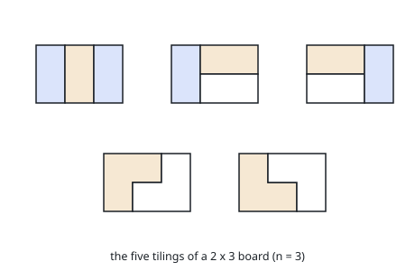

# Domino and Tromino Tiling

## Description

You have two types of tiles: a `2 x 1` domino shape and a tromino shape. You may rotate these shapes.

Given an integer `n`, return the number of ways to tile an `2 x n` board. Since the answer may be very large, return it modulo `10^9 + 7`.

In a tiling, every square must be covered by a tile. Two tilings are different if and only if there are two 4-directionally adjacent cells on the board such that exactly one of the tilings has both squares occupied by a tile.

### Example 1

```text
Input: n = 3
Output: 5
Explanation: The five different ways are shown above.
```



### Example 2

```text
Input: n = 1
Output: 1
```

### Constraints

- `1 <= n <= 1000`

## Hints

### Hint 1

Track two DP states per column: fully covered columns, and columns with one cell sticking out from a tromino.

### Hint 2

A fully covered column i comes from a vertical domino, two horizontal dominoes, or a tromino pair continuing either stick-out state.

### Hint 3

The recurrence simplifies to f(n) = 2*f(n-1) + f(n-3); compute it modulo 10^9 + 7.
