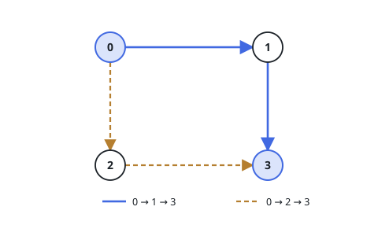
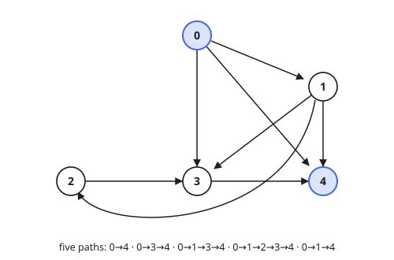

# All Paths From Source to Target

## Description

Given a directed acyclic graph (DAG) of `n` nodes labeled from `0` to
`n - 1`, find all possible paths from node `0` to node `n - 1` and return them
in any order.

The graph is given as follows: `graph[i]` is a list of all nodes you can visit
from node `i` (i.e., there is a directed edge from node `i` to
`graph[i][j]`).

If several orderings exist, the judge expects the order produced by a
depth-first search from node `0` that visits each node's neighbors in the
order they appear in `graph[i]`.

### Example 1

```text
Input: graph = [[1,2],[3],[3],[]]
Output: [[0,1,3],[0,2,3]]
Explanation: There are two paths: 0 -> 1 -> 3 and 0 -> 2 -> 3.
```



### Example 2

```text
Input: graph = [[4,3,1],[3,2,4],[3],[4],[]]
Output: [[0,4],[0,3,4],[0,1,3,4],[0,1,2,3,4],[0,1,4]]
```



### Constraints

- `n == graph.length`
- `2 <= n <= 15`
- `0 <= graph[i][j] < n`
- `graph[i][j] != i` (i.e., there will be no self-loops).
- All the elements of `graph[i]` are unique.
- The input graph is guaranteed to be a DAG.

## Hints

### Hint 1

Walk the graph with DFS from node 0, carrying the current path in a list.

### Hint 2

When you reach node n - 1, record a copy of the current path as one answer.

### Hint 3

Backtrack by popping the last node before trying the next neighbor; dead ends simply return without recording anything.
