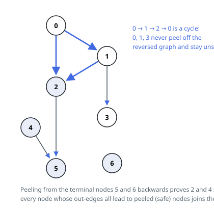

# Solutions — Find Eventual Safe States

## Reverse-graph topological peel

A node is unsafe exactly when it lies on a directed cycle or can reach one; safe nodes are those from which every path eventually terminates. Running a topological peel on the reversed graph captures this directly: compute each node's out-degree, build the reversed adjacency list, and seed a queue with the terminal nodes (out-degree 0). Repeatedly pop a node, mark it safe, and decrement the out-degree of every predecessor — a predecessor enters the queue only when all of its outgoing neighbors have been proven safe, which is precisely the definition of a safe node.

This is Kahn's algorithm run on the transpose: nodes remaining unpeeled at the end are exactly those entangled in cycles (including through reachable cycles), so they stay unsafe. A self-loop is handled naturally — its edge contributes 1 to the node's own out-degree and is only decremented when the node itself is peeled, which can never happen first, so self-looped nodes never become safe.

The final answer is collected by scanning indices in ascending order and keeping the marked ones, which yields the required sorted order without an explicit sort. Edges are traversed once when building the transpose and once when peeling.

**Complexity:** `O(V + E)` time, `O(V + E)` space for the reversed adjacency, out-degree array, and queue.
