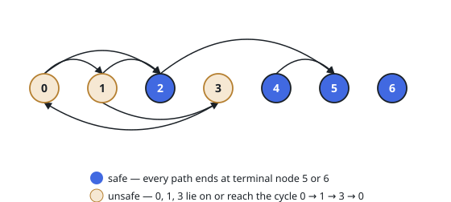

# Find Eventual Safe States

## Description

There is a directed graph of `n` nodes with each node labeled from `0` to `n - 1`.
The graph is represented by a 0-indexed 2D integer array `graph` where `graph[i]`
is an integer array of nodes adjacent to node `i`, meaning there is an edge from
node `i` to each node in `graph[i]`.

A node is a **terminal node** if there are no outgoing edges. A node is a
**safe node** if every possible path starting from that node leads to a
terminal node (or another safe node).

Return an array containing all the safe nodes of the graph. The answer should
be sorted in ascending order.

### Example 1

```text
Input: graph = [[1,2],[2,3],[5],[0],[5],[],[]]
Output: [2,4,5,6]
Explanation: The nodes 2, 4, 5, and 6 are safe.
Nodes 5 and 6 are terminal nodes as there are no outgoing edges from either of them.
Every path starting at nodes 2, 4, 5, and 6 all lead to either node 5 or 6.
```



### Example 2

```text
Input: graph = [[1,2,3,4],[1,2],[3,4],[0,4],[]]
Output: [4]
Explanation: Only node 4 is a terminal node, and every path starting at node 4
leads to node 4.
```

### Constraints

- `n == graph.length`
- `1 <= n <= 10^4`
- `0 <= graph[i].length <= n`
- `0 <= graph[i][j] <= n - 1`
- `graph[i]` is sorted in a strictly increasing order.
- The graph may contain self-loops.
- The number of edges in the graph is in the range `[1, 4 * 10^4]`.

## Hints

### Hint 1

A node is unsafe exactly when it sits on a directed cycle or can reach one; every path from a safe node eventually dead-ends at a terminal node.

### Hint 2

Run a topological sort on the reversed graph starting from the terminal nodes (out-degree 0): peel nodes backwards, and a node becomes safe once all of its outgoing neighbors are safe.

### Hint 3

A self-loop makes its node unsafe, since the node can reach itself forever.
