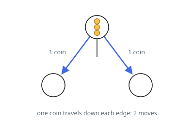
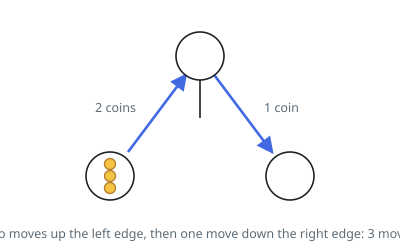

# Distribute Coins in Binary Tree

## Description

You are given the `root` of a binary tree with `n` nodes where each node in the
tree has `node.val` coins. There are `n` coins in total throughout the whole
tree.

In one move, we may choose two adjacent nodes and move one coin from one node
to another. A move may be from parent to child, or from child to parent.

Return the minimum number of moves required to make every node have exactly
one coin.

### Example 1

```text
Input: root = [3,0,0]
Output: 2
Explanation: From the root of the tree, we move one coin to its left child,
and one coin to its right child.
```



### Example 2

```text
Input: root = [0,3,0]
Output: 3
Explanation: From the left child of the tree, we move two coins to the root
(taking two moves). Then, we move one coin from the root of the tree to the
right child.
```



### Constraints

- The number of nodes in the tree is `n`.
- `1 <= n <= 100`
- `0 <= Node.val <= n`
- The sum of all `Node.val` is `n`.

## Hints

### Hint 1

Think about the net number of coins that must flow across each edge: a subtree with s nodes and c coins must exchange |c - s| coins with the rest of the tree.

### Hint 2

Do a post-order DFS returning the excess coins of each subtree (coins minus nodes); null subtrees have excess 0.

### Hint 3

Every edge's |excess| contributes exactly that many moves, so accumulate the absolute values of the children's excesses.
