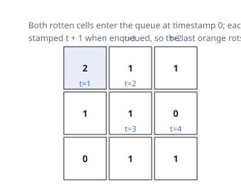

# Solutions — Rotting Oranges

## Multi-source BFS

The answer is the time at which the last fresh orange rots, and rot spreads one cell per minute from every rotten cell simultaneously — this is precisely a shortest-path quantity, so a breadth-first search seeded with all initially rotten oranges at once computes it. The scan first collects every cell holding a `2` into the queue with timestamp 0 and counts the fresh oranges (`1`s) so it can detect stragglers later.

Each dequeued entry carries its infection time `t`; popping one updates `minutes = max(minutes, t)`, which spares the need to process the queue in per-minute batches. A fresh neighbor is flipped to `2` at the moment it is enqueued (with timestamp `t + 1`) rather than when it is popped. Marking on enqueue guarantees every cell enters the queue at most once, keeps `fresh` in sync with the grid, and prevents duplicate queue entries from inflating the work.

The grid is copied row by row first so the caller's input is never mutated. When the queue drains, any remaining `fresh > 0` means some orange was walled off from the rot and the answer is `-1`; a grid with no fresh oranges at all never raises `minutes` above 0, matching the "already done" case.

**Complexity:** `O(m * n)` time, `O(m * n)` space for the queue and the grid copy.
