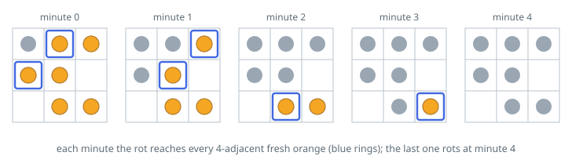

# Rotting Oranges

## Description

You are given an `m x n` `grid` where each cell can have one of three
values:

- `0` representing an empty cell,
- `1` representing a fresh orange, or
- `2` representing a rotten orange.

Every minute, any fresh orange that is 4-directionally adjacent to a rotten
orange becomes rotten.

Return the minimum number of minutes that must elapse until no cell has a
fresh orange. If this is impossible, return `-1`.

### Example 1

```text
Input: grid = [[2,1,1],[1,1,0],[0,1,1]]
Output: 4
```



### Example 2

```text
Input: grid = [[2,1,1],[0,1,1],[1,0,1]]
Output: -1
Explanation: The orange in the bottom left corner (row 2, column 0) is never
rotten, because rotting only happens 4-directionally.
```

### Example 3

```text
Input: grid = [[0,2]]
Output: 0
Explanation: Since there are already no fresh oranges at minute 0, the answer
is just 0.
```

### Constraints

- `m == grid.length`
- `n == grid[i].length`
- `1 <= m, n <= 10`
- `grid[i][j]` is `0`, `1`, or `2`.

## Hints

### Hint 1

Simulate the spread minute by minute with a breadth-first search starting from every rotten orange at once.

### Hint 2

Track the BFS level (or process the queue in per-minute batches) to count the elapsed minutes.

### Hint 3

After the BFS finishes, any orange still fresh means the answer is -1; a grid with no fresh oranges at all yields 0.
