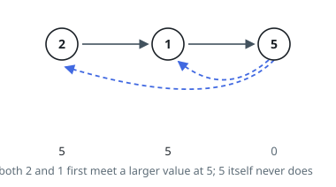
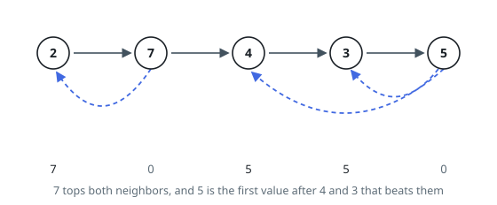

# Next Greater Node In Linked List

## Description

You are given the `head` of a linked list with `n` nodes.

For each node in the list, find the value of the **next greater node**. That
is, for each node, find the value of the first node that is next to it and has
a strictly larger value than it.

Return an integer array `answer` where `answer[i]` is the value of the next
greater node of the `ith` node (**1-indexed**). If the `ith` node does not have
a next greater node, set `answer[i] = 0`.

### Example 1

```text
Input: head = [2,1,5]
Output: [5,5,0]
```



### Example 2

```text
Input: head = [2,7,4,3,5]
Output: [7,0,5,5,0]
```



### Constraints

- The number of nodes in the list is `n`.
- `1 <= n <= 10^4`
- `1 <= Node.val <= 10^9`

## Hints

### Hint 1

Use a stack that stores node indices in monotonically decreasing order of value. When you see a value that is larger, it is the next larger value for every smaller index on the stack.

### Hint 2

Collect the values into an array first so you can work with indices, then pop the stack while its top value is smaller than the current one.

### Hint 3

Indices still on the stack at the end have no next greater node — leave their answer as 0.
