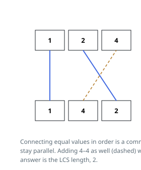

# Solutions — Uncrossed Lines

## Longest common subsequence with rolling rows

The problem is the longest common subsequence in disguise. A set of connecting lines pairs equal values that appear in increasing order in both arrays — precisely a common subsequence — and any common subsequence can be drawn without crossings by connecting its pairs in order. So the answer is the LCS length of `nums1` and `nums2`.

The DP over prefixes is kept at two rows: `prev` holds the answers for the previous prefix of `nums1`, and for each element `a` a fresh `cur` row is built over `nums2`. On a match (`a == nums2[j - 1]`), matching the pair is always at least as good as skipping either element, so `cur[j] = prev[j - 1] + 1`; otherwise the best of dropping `a` or dropping `nums2[j - 1]` survives: `max(cur[j - 1], prev[j])`. `cur[0]` stays 0 since an empty prefix matches nothing.

Keeping only the previous and current rows reduces the space from the full `m x n` table to a single row plus the one under construction, and the final `prev[n]` after the last row is the answer.

**Complexity:** `O(m * n)` time, `O(n)` space for the two rows over `nums2`.
