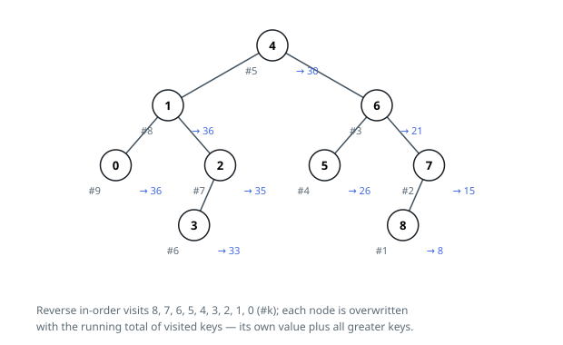

# Solutions — Binary Search Tree to Greater Sum Tree

## Reverse in-order running sum

In a BST, an in-order traversal visits keys in increasing order; reversing it — right subtree, then the node, then the left subtree — visits keys from largest to smallest. At the moment this traversal reaches a node, every strictly greater key in the tree has already been visited, which is exactly the set the node's new value must add up.

The traversal keeps `total`, the sum of all values visited so far. On reaching a node it first recurses right, then adds `current.val` into `total`, and immediately overwrites `current.val` with that running total — the node's original key plus the sum of all greater keys. Recursing left afterwards propagates the accumulated total down the remaining (smaller) keys, each of which sees an even larger set of already-visited greater values.

The tree is rewired in place, structure untouched, and the root is returned as required. A single-node tree simply receives its own value back, and a chain (all keys on one side) exercises the recursion depth worst case.

**Complexity:** `O(n)` time, `O(h)` space for the recursion stack (`O(n)` worst case on a chain).
