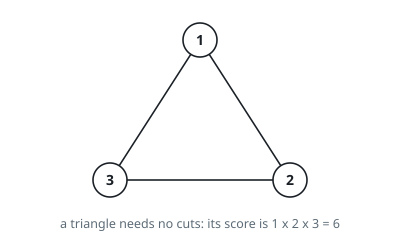
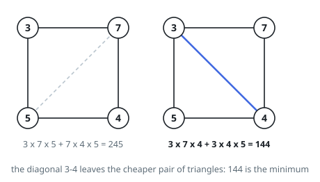
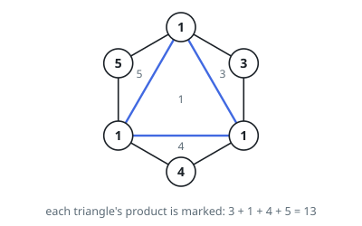

# Minimum Score Triangulation of Polygon

## Description

You have a convex `n`-sided polygon where each vertex has an integer value.
You are given an integer array `values` where `values[i]` is the value of the
`i`th vertex in clockwise order.

Polygon triangulation is a process where you divide a polygon into a set of
triangles and the vertices of each triangle must also be vertices of the
original polygon. Note that no other shapes other than triangles are allowed
in the division. This process will result in `n - 2` triangles.

You will triangulate the polygon. For each triangle, the weight of that
triangle is the product of the values at its vertices. The total score of the
triangulation is the sum of these weights over all `n - 2` triangles.

Return the minimum possible score that you can achieve with some triangulation
of the polygon.

### Example 1

```text
Input: values = [1,2,3]
Output: 6
Explanation: The polygon is already triangulated, and the score of the only
triangle is 6.
```



### Example 2

```text
Input: values = [3,7,4,5]
Output: 144
Explanation: There are two triangulations, with possible scores:
3*7*5 + 4*5*7 = 245, or 3*4*5 + 3*4*7 = 144. The minimum score is 144.
```



### Example 3

```text
Input: values = [1,3,1,4,1,5]
Output: 13
Explanation: The minimum score triangulation is
1*1*3 + 1*1*4 + 1*1*5 + 1*1*1 = 13.
```



### Constraints

- `n == values.length`
- `3 <= n <= 50`
- `1 <= values[i] <= 100`

## Hints

### Hint 1

Without loss of generality, some triangle uses the adjacent vertices A[0] and A[N-1]; depending on your choice of its third vertex K, the problem splits into the sub-polygons A[1..K] and A[K..N-1].

### Hint 2

Define dp(i, j) as the minimum score for triangulating the sub-polygon from vertex i to vertex j, and try every intermediate vertex as the apex.

### Hint 3

A sub-polygon with fewer than 3 vertices needs no triangulation (score 0).
