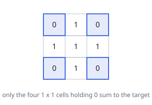

# Number of Submatrices That Sum to Target

## Description

Given a matrix and a target, return the number of non-empty submatrices that
sum to `target`.

A submatrix `x1, y1, x2, y2` is the set of all cells `matrix[x][y]` with
`x1 <= x <= x2` and `y1 <= y <= y2`.

Two submatrices `(x1, y1, x2, y2)` and `(x1', y1', x2', y2')` are different if
they have some coordinate that is different: for example, if `x1 != x1'`.

### Example 1

```text
Input: matrix = [[0,1,0],[1,1,1],[0,1,0]], target = 0
Output: 4
Explanation: The four 1x1 submatrices that only contain 0.
```



### Example 2

```text
Input: matrix = [[1,-1],[-1,1]], target = 0
Output: 5
Explanation: The two 1x2 submatrices, plus the two 2x1 submatrices, plus the 2x2 submatrix.
```

### Example 3

```text
Input: matrix = [[904]], target = 0
Output: 0
```

### Constraints

- `1 <= matrix.length <= 100`
- `1 <= matrix[0].length <= 100`
- `-1000 <= matrix[i][j] <= 1000`
- `-10⁸ <= target <= 10⁸`

## Hints

### Hint 1

Using a 2D prefix sum, you can query the sum of any submatrix in O(1) time.

### Hint 2

For each pair of row bounds (r1, r2), collapse those rows into a single column-sum array, then count the subarrays that sum to target using a running-sum hash map.
