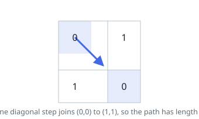
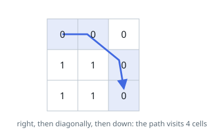

# Shortest Path in Binary Matrix

## Description

Given an `n x n` binary matrix `grid`, return the length of the shortest
clear path in the matrix. If there is no clear path, return `-1`.

A clear path in a binary matrix is a path from the top-left cell (i.e.,
`(0, 0)`) to the bottom-right cell (i.e., `(n - 1, n - 1)`) such that:

- All the visited cells of the path are `0`.
- All the adjacent cells of the path are 8-directionally connected (i.e., they
  are different and they share an edge or a corner).

The length of a clear path is the number of visited cells of this path.

### Example 1

```text
Input: grid = [[0,1],[1,0]]
Output: 2
```



### Example 2

```text
Input: grid = [[0,0,0],[1,1,0],[1,1,0]]
Output: 4
```



### Example 3

```text
Input: grid = [[1,0,0],[1,1,0],[1,1,0]]
Output: -1
```

### Constraints

- `n == grid.length`
- `n == grid[i].length`
- `1 <= n <= 100`
- `grid[i][j]` is `0` or `1`.

## Hints

### Hint 1

Do a breadth-first search from (0, 0) to find the shortest path.

### Hint 2

From each cell, expand to all 8 neighbors that are in bounds and hold a 0.

### Hint 3

Track visited cells so each is processed at most once; the first time you reach (n-1, n-1) is the shortest path.
