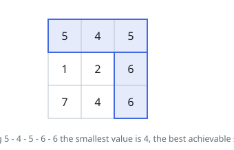
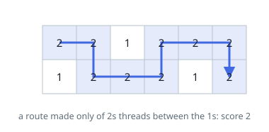
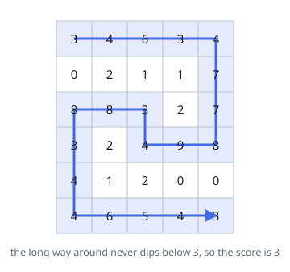

# Path With Maximum Minimum Value

## Description

Given an `m x n` integer matrix `grid`, return the maximum **score** of a path
starting at `(0, 0)` and ending at `(m - 1, n - 1)` moving in the 4 cardinal
directions.

The score of a path is the minimum value in that path.

- For example, the score of the path `8 -> 4 -> 5 -> 9` is `4`.

### Example 1

```text
Input: grid = [[5,4,5],[1,2,6],[7,4,6]]
Output: 4
Explanation: The path with the maximum score is highlighted in yellow.
```



### Example 2

```text
Input: grid = [[2,2,1,2,2,2],[1,2,2,2,1,2]]
Output: 2
```



### Example 3

```text
Input: grid = [[3,4,6,3,4],[0,2,1,1,7],[8,8,3,2,7],[3,2,4,9,8],[4,1,2,0,0],[4,6,5,4,3]]
Output: 3
```



### Constraints

- `m == grid.length`
- `n == grid[i].length`
- `1 <= m, n <= 100`
- `0 <= grid[i][j] <= 10^9`

## Hints

### Hint 1

Process cells in decreasing order of value, adding them as usable path cells.

### Hint 2

Once the start and the end are connected through usable cells, stop; the answer is the value of the cell that made them connected.

### Hint 3

Use a union-find data structure to check connectivity incrementally.

### Hint 4

Alternatively, run a Dijkstra-like greedy with a max-heap that always expands the highest-value frontier cell and tracks the running minimum.
