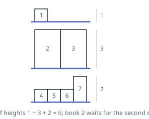

# Filling Bookcase Shelves

## Description

You are given an array `books` where `books[i] = [thickness_i, height_i]` indicates
the thickness and height of the `i`-th book. You are also given an integer
`shelfWidth`.

We want to place these books in order onto bookcase shelves that have a total
width `shelfWidth`.

We choose some of the books to place on this shelf such that the sum of their
thickness is less than or equal to `shelfWidth`, then build another level of the
shelf of the bookcase so that the total height of the bookcase has increased by
the maximum height of the books we just put down. We repeat this process until
there are no more books to place.

Note that at each step of the above process, the order of the books we place is
the same order as the given sequence of books.

- For example, if we have an ordered list of 5 books, we might place the first
  and second book onto the first shelf, the third book on the second shelf, and
  the fourth and fifth book on the last shelf.

Return the minimum possible height that the total bookshelf can be after
placing shelves in this manner.

### Example 1

```text
Input: books = [[1,1],[2,3],[2,3],[1,1],[1,1],[1,1],[1,2]], shelfWidth = 4
Output: 6
Explanation:
The sum of the heights of the 3 shelves is 1 + 3 + 2 = 6.
Notice that book number 2 does not have to be on the first shelf.
```



### Example 2

```text
Input: books = [[1,3],[2,4],[3,2]], shelfWidth = 6
Output: 4
```

### Constraints

- `1 <= books.length <= 1000`
- `1 <= thickness_i <= shelfWidth <= 1000`
- `1 <= height_i <= 1000`

## Hints

### Hint 1

Use dynamic programming: dp(i) is the minimum total height for the suffix books[i:].

### Hint 2

For each i, try every possible first shelf: books[i..j-1] as long as their total thickness stays within shelfWidth.

### Hint 3

That shelf contributes max(height of books[i..j-1]) plus dp(j), so dp(i) is the minimum over all valid j.
