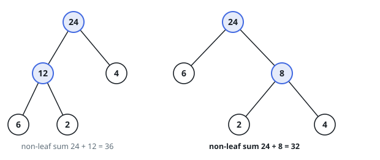
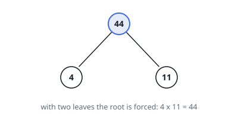

# Minimum Cost Tree From Leaf Values

## Description

Given an array `arr` of positive integers, consider all binary trees such that:

- Each node has either `0` or `2` children.
- The values of `arr` correspond to the values of each leaf in an in-order
  traversal of the tree.
- The value of each non-leaf node is equal to the product of the largest leaf
  value in its left and right subtree, respectively.

Among all possible binary trees considered, return the smallest possible sum of
the values of each non-leaf node. It is guaranteed this sum fits into a 32-bit
integer.

A node is a leaf if and only if it has zero children.

### Example 1

```text
Input: arr = [6,2,4]
Output: 32
Explanation: There are two possible trees shown.
The first has a non-leaf node sum 36, and the second has non-leaf node sum 32.
```



### Example 2

```text
Input: arr = [4,11]
Output: 44
```



### Constraints

- `2 <= arr.length <= 40`
- `1 <= arr[i] <= 15`
- It is guaranteed that the answer fits into a 32-bit signed integer (i.e. it
  is less than `2^31`).

## Hints

### Hint 1

Do a DP, where dp(i, j) is the answer for the subarray arr[i..j].

### Hint 2

For each possible way to partition the subarray i <= k < j, the answer is max(arr[i..k]) * max(arr[k+1..j]) + dp(i, k) + dp(k+1, j).

### Hint 3

Precomputing the maximum leaf value of every subrange keeps each transition cheap.
