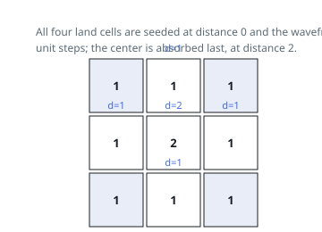

# Solutions — As Far from Land as Possible

## Multi-Source BFS

Instead of asking, for every water cell, how far its nearest land is, reverse the direction of search: start one BFS from all land cells simultaneously and expand outward. Because every land cell starts at distance 0, the first time the wavefront reaches a water cell is exactly its distance to the nearest land — a multi-source BFS computes nearest-source distances for all cells in one pass. The last cells absorbed sit at the largest distance, which is what the problem wants.

The grid is copied first (the input must not be mutated), all land cells are seeded into the queue, and a visited marker comes free: a water cell flips to 1 as it is enqueued, so it can never be queued twice. The BFS runs level by level, snapshotting the queue length each round; `dist` counts the levels processed. Each level steps in the four cardinal directions — which matches the Manhattan distance metric here, since on an unobstructed grid the shortest 4-directional path length equals the Manhattan distance.

Two degenerate grids are rejected up front: no land at all (empty seed queue) or no water at all (queue already holds every cell) both return -1. When water exists, the loop runs one final round on the deepest level that adds nothing, so the returned value is `dist - 1`; a grid with land adjacent to water yields 1, as expected. An `n x n` grid is fully processed once.

**Complexity:** `O(n^2)` time, `O(n^2)` space.
