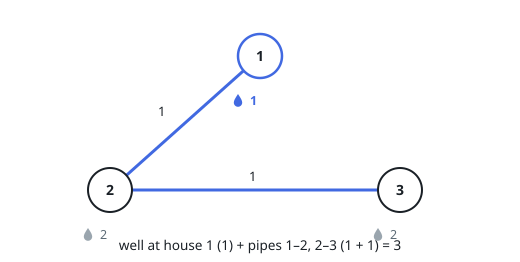

# Optimize Water Distribution in a Village

## Description

There are `n` houses in a village. We want to supply water for all the houses
by building wells and laying pipes.

For each house `i`, we can either build a well inside it directly with cost
`wells[i - 1]` (note the `-1` due to 0-indexing), or pipe in water from another
well to it. The costs to lay pipes between houses are given by the array
`pipes` where each `pipes[j] = [house1_j, house2_j, cost_j]` represents the
cost to connect `house1_j` and `house2_j` together using a pipe. Connections
are bidirectional, and there could be multiple valid connections between the
same two houses with different costs.

Return the minimum total cost to supply water to all houses.

### Example 1

```text
Input: n = 3, wells = [1,2,2], pipes = [[1,2,1],[2,3,1]]
Output: 3
Explanation: The image shows the costs of connecting houses using pipes.
The best strategy is to build a well in the first house with cost 1 and connect
the other houses to it with cost 2 so the total cost is 3.
```



### Example 2

```text
Input: n = 2, wells = [1,1], pipes = [[1,2,1],[1,2,2]]
Output: 2
Explanation: We can supply water with cost two using one of the three options:
Option 1: build a well inside house 1 (cost 1) and a well inside house 2 (cost 1).
Option 2: build a well inside house 1 (cost 1) and connect house 2 to it (cost 1).
Option 3: build a well inside house 2 (cost 1) and connect house 1 to it (cost 1).
Note that houses 1 and 2 can be connected with cost 1 or cost 2, and we always
choose the cheapest option.
```

### Constraints

- `2 <= n <= 10^4`
- `wells.length == n`
- `0 <= wells[i] <= 10^5`
- `1 <= pipes.length <= 10^4`
- `pipes[j].length == 3`
- `1 <= house1_j, house2_j <= n`
- `0 <= cost_j <= 10^5`
- `house1_j != house2_j`

## Hints

### Hint 1

Model the village as a graph: a house is a node and a pipe is a weighted edge.

### Hint 2

Represent building a well by adding a virtual node connected to each house with an edge weighted by that house's well cost.

### Hint 3

The problem then reduces to a Minimum Spanning Tree over the houses plus the virtual node.

### Hint 4

Kruskal's algorithm with union-find, or Prim's algorithm, both work well.
