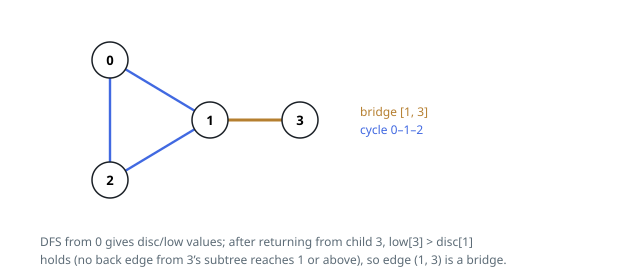

# Solutions — Critical Connections in a Network

## Tarjan's Bridge Finding

The key insight is that an edge is critical exactly when it is a bridge: no alternative path connects its two endpoints. In an undirected graph, every edge is either a tree edge of some DFS spanning forest or a back edge to an ancestor. A back edge always lies on a cycle, so only tree edges can be bridges, and a tree edge `(u, v)` is a bridge precisely when no back edge from anywhere inside `v`'s subtree reaches `u` or any of its ancestors.

A single depth-first search from node 0 (the graph is connected, so one root suffices) tracks two numbers per node: `disc[u]`, the global discovery time, and `low[u]`, the earliest discovery time reachable from `u`'s subtree using any number of tree edges followed by at most one back edge. After returning from a child `v`, the parent updates `low[u] = min(low[u], low[v])` and tests the bridge condition `low[v] > disc[u]`: if `v`'s subtree cannot see past `u`, the edge between them is the only route and is recorded. Back edges to a node other than the parent relax `low[u]` with the neighbor's `disc` value; the parent check is required because the edge to the parent is the tree edge itself, not a cycle.

Because every one of the `e` connections is stored in both adjacency lists and examined a constant number of times, the whole pass over the `n` servers is linear. The graph is guaranteed connected, so the initial `dfs(0, -1)` visits every server; the collected bridges are sorted at the end only to give a deterministic output order, contributing the logarithmic factor.

**Complexity:** `O(n + e log e)` time, `O(n + e)` space.
