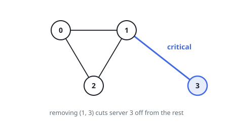

# Critical Connections in a Network

## Description

There are `n` servers numbered from `0` to `n - 1` connected by undirected
server-to-server connections forming a network where `connections[i] = [ai, bi]`
represents a connection between servers `ai` and `bi`. Any server can reach
other servers directly or indirectly through the network.

A **critical connection** is a connection that, if removed, will make some
servers unable to reach some other server.

Return all critical connections in the network in **any order**.

### Example 1

```text
Input: n = 4, connections = [[0,1],[1,2],[2,0],[1,3]]
Output: [[1,3]]
Explanation: [[3,1]] is also accepted.
```



### Example 2

```text
Input: n = 2, connections = [[0,1]]
Output: [[0,1]]
```

### Constraints

- `2 <= n <= 10⁵`
- `n - 1 <= connections.length <= 10⁵`
- `0 <= ai, bi <= n - 1`
- `ai != bi`
- There are no repeated connections.

## Hints

### Hint 1

Use Tarjan's algorithm.

### Hint 2

During a depth-first search, track the earliest-discovered ancestor reachable from each node; an edge (u, v) is a bridge when no back edge from v's subtree reaches u or an ancestor of u.
