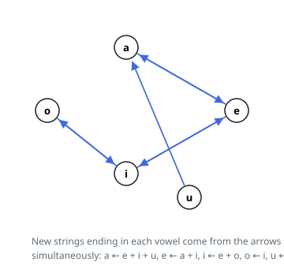

# Solutions — Count Vowels Permutation

## Dynamic Programming with Rolling Counters

The key insight is that a valid string of length `n` is built by appending one vowel at a time, and the only thing that constrains the next character is the last character of the prefix. So the count of valid strings of length `L` ending in each vowel determines everything about length `L + 1`, and five numbers per step suffice.

The solution keeps one counter per vowel, all initialized to 1 for the length-1 strings. Each step applies the follower rules as a simultaneous update: a new string ending in `'a'` comes from a prefix ending in `'e'`, `'i'`, or `'u'`; one ending in `'e'` from `'a'` or `'i'`; one ending in `'i'` from `'e'` or `'o'`; one ending in `'o'` only from `'i'`; and one ending in `'u'` from `'i'` or `'o'`. Reading the old values on the right-hand side of the tuple assignment and binding all five at once prevents a partially updated state from leaking into the same step's computation.

Because the follower graph has no self-loop on `'i'` (and none at all in the strict "may only be followed by" rules), every contribution crosses a distinct vowel and no term is counted twice. The modulo is applied to each new counter as it is formed, keeping intermediate values bounded even though the raw counts grow exponentially with `n`. After `n - 1` transitions the answer is the sum of the five counters, reduced once more; for `n = 1` the loop body never runs and the sum is the initial 5.

**Complexity:** `O(n)` time, `O(1)` space.
