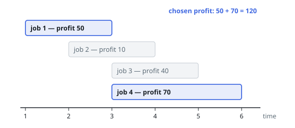
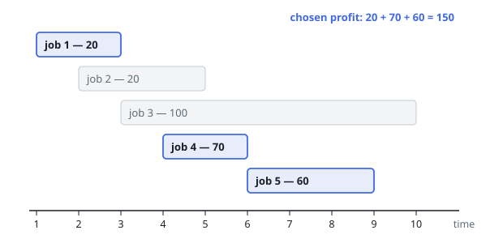
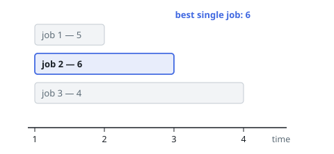

# Maximum Profit in Job Scheduling

## Description

We have `n` jobs, where every job is scheduled to be done from `startTime[i]`
to `endTime[i]`, obtaining a profit of `profit[i]`.

You're given the `startTime`, `endTime` and `profit` arrays, return the
maximum profit you can take such that there are no two jobs in the subset with
overlapping time range.

If you choose a job that ends at time `X` you will be able to start another
job that starts at time `X`.

### Example 1

```text
Input: startTime = [1,2,3,3], endTime = [3,4,5,6], profit = [50,10,40,70]
Output: 120
Explanation: The subset chosen is the first and fourth job.
Time range [1-3]+[3-6], we get profit of 120 = 50 + 70.
```



### Example 2

```text
Input: startTime = [1,2,3,4,6], endTime = [3,5,10,6,9], profit = [20,20,100,70,60]
Output: 150
Explanation: The subset chosen is the first, fourth and fifth job.
Profit obtained 150 = 20 + 70 + 60.
```



### Example 3

```text
Input: startTime = [1,1,1], endTime = [2,3,4], profit = [5,6,4]
Output: 6
```



### Constraints

- `1 <= startTime.length == endTime.length == profit.length <= 5 * 10^4`
- `1 <= startTime[i] < endTime[i] <= 10^9`
- `1 <= profit[i] <= 10^4`

## Hints

### Hint 1

Think on DP.

### Hint 2

Sort the elements by starting time, then define the dp[i] as the maximum profit taking elements from the suffix starting at i.

### Hint 3

Use binarySearch (lower_bound/upper_bound on C++) to get the next index for the DP transition.
