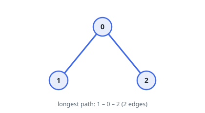
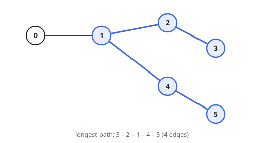

# Tree Diameter

## Description

The diameter of a tree is the number of edges in the longest path in that
tree.

There is an undirected tree of `n` nodes labeled from `0` to `n - 1`. You are
given a 2D array `edges` where `edges.length == n - 1` and
`edges[i] = [ai, bi]` indicates that there is an undirected edge between nodes
`ai` and `bi` in the tree.

Return the diameter of the tree.

### Example 1

```text
Input: edges = [[0,1],[0,2]]
Output: 2
Explanation: The longest path of the tree is the path 1 - 0 - 2.
```



### Example 2

```text
Input: edges = [[0,1],[1,2],[2,3],[1,4],[4,5]]
Output: 4
Explanation: The longest path of the tree is the path 3 - 2 - 1 - 4 - 5.
```



### Constraints

- `n == edges.length + 1`
- `1 <= n <= 10^4`
- `0 <= ai, bi < n`
- `ai != bi`

## Hints

### Hint 1

Start at any node A and traverse the tree to find the furthest node from it, call it B.

### Hint 2

Having found the furthest node B, traverse the tree from B to find the furthest node from it, call it C.

### Hint 3

The distance between B and C is the tree diameter.
